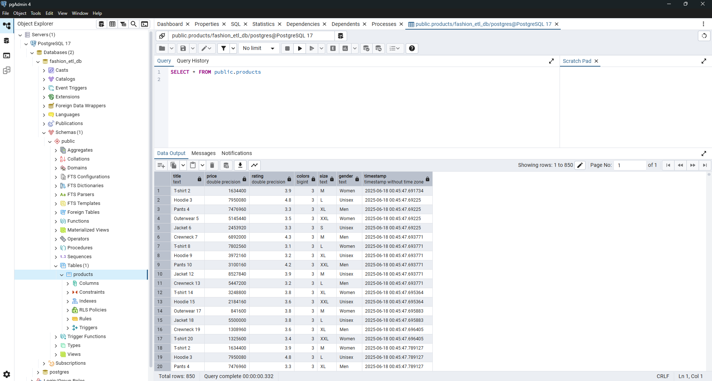

# ETL Pipeline Sederhana: Data Produk Fashion Studio

Repository ini berisi implementasi proyek akhir untuk kelas **Belajar Fundamental Pemrosesan Data**, yaitu membangun sebuah pipeline Extract, Transform, Load (ETL) yang tangguh dan teruji. Proyek ini merupakan bagian dari program **Coding Camp 2025 by DBS Foundation**.

| Keterangan     | Informasi                         |
| :------------- | :---------------------------------- |
| **Nama Lengkap** | Maulana Seno Aji Yudhantara         |
| **Cohort ID** | MC117D5Y1789                        |
| **Mentor** | Yeftha Joshua Ezekiel               |

---

## 📖 Ringkasan Proyek

Proyek ini mensimulasikan tugas seorang *Data Engineer* di sebuah perusahaan retail fashion. Tujuannya adalah membangun sebuah pipeline data otomatis untuk melakukan *web scraping* data produk dari situs kompetitor (Fashion Studio), membersihkan dan mentransformasi data tersebut, lalu memuatnya ke dalam beberapa sistem penyimpanan data untuk dianalisis lebih lanjut oleh tim Data Science.

## ⚙️ Fitur Utama & Teknologi

Pipeline ini dirancang dengan beberapa fitur utama untuk memastikan kualitas dan keandalan data:
-   **Modularitas**: Kode dipisahkan berdasarkan fungsinya (`extract`, `transform`, `load`) untuk keterbacaan dan pemeliharaan yang lebih baik.
-   **Pemuatan Multi-Repositori**: Data bersih dimuat ke tiga tujuan berbeda: **CSV**, **Google Sheets**, dan **PostgreSQL**.
-   **Penanganan Kesalahan**: Setiap fungsi utama dalam pipeline dilengkapi dengan blok `try-except` untuk menangani potensi eror saat runtime.
-   **Teruji (Unit Tested)**: Kualitas kode divalidasi dengan *unit test* menggunakan `pytest`, dengan *test coverage* mencapai lebih dari 80%.

**Teknologi yang Digunakan:**
-   **Bahasa**: Python 3
-   **Library**: `requests`, `beautifulsoup4`, `pandas`, `sqlalchemy`, `psycopg2-binary`, `gspread`, `pytest`, `pytest-cov`

## 📁 Struktur Repository
```
ETL-Pipeline-Fashion-Studio/
│
├── utils/                # Modul-modul utama pipeline
│   ├── extract.py
│   ├── transform.py
│   └── load.py
│
├── tests/                # Unit test untuk setiap modul
│   ├── test_extract.py
│   ├── test_transform.py
│   └── test_load.py
│
├── images/               # Aset gambar untuk dokumentasi
│   └── postgresql_result.png
│
├── main.py               # Skrip utama untuk menjalankan pipeline
├── requirements.txt      # Daftar dependensi library
├── submission.txt        # Instruksi untuk reviewer
├── products.csv          # Output data bersih dalam format CSV
└── google-sheets-api.json # Kredensial API Google Sheets
```

## 🚀 Hasil Akhir

Pipeline berhasil mengekstrak 1000 data produk mentah, yang setelah melalui proses transformasi (pembersihan data invalid, duplikat, dan null), menghasilkan **850 baris data bersih**. Data ini kemudian berhasil dimuat ke tiga repositori.

Berikut adalah bukti bahwa data telah berhasil dimuat ke dalam tabel `products` di database PostgreSQL:


## ✨ Hasil Utama & Pencapaian

Proyek ini berhasil mencapai beberapa target teknis utama yang menunjukkan kualitas dan keandalan pipeline yang dibangun:

* **Pipeline ETL End-to-End Fungsional**: Pipeline yang dibangun mampu berjalan secara otomatis dari awal hingga akhir, mulai dari mengekstrak data dari 50 halaman web hingga menghasilkan 850 baris data produk yang bersih dan siap pakai.

* **Transformasi Data yang Komprehensif**: Proses transformasi berhasil menangani berbagai masalah kualitas data, termasuk:
    * Menghapus data yang tidak valid, duplikat, dan bernilai null.
    * Mengonversi harga dari Dolar ke Rupiah dan membersihkan format data pada setiap kolom (Rating, Colors, Size, Gender) sesuai standar yang ditentukan.
    * Seluruh fungsi utama dalam pipeline dilengkapi dengan mekanisme *error handling* (`try-except`) untuk memastikan ketangguhan saat terjadi masalah, seperti kegagalan koneksi.
    * Data diperkaya dengan kolom `timestamp` untuk melacak waktu ekstraksi.

* **Pemuatan Data Multi-Destinasi**: Untuk menunjukkan fleksibilitas, data yang telah bersih berhasil dimuat secara otomatis ke tiga jenis repositori data yang berbeda: **file CSV**, **Google Sheets**, dan database **PostgreSQL**.

* **Kode Teruji dengan Standar Tinggi**: Kualitas dan keandalan kode divalidasi melalui *unit testing* yang komprehensif menggunakan `pytest`.
    * Pengujian berhasil mencapai **test coverage lebih dari 80%**, yang menandakan sebagian besar alur logika kode telah terverifikasi.
    * Pengujian untuk fungsi yang berinteraksi dengan layanan eksternal (seperti *web scraping*) dilakukan menggunakan teknik *mocking* untuk memastikan tes berjalan secara independen, cepat, dan andal.

## 🚀 Cara Menjalankan Proyek

Untuk menjalankan proyek ini di lingkungan lokal Anda, ikuti langkah-langkah berikut:

1.  **Prasyarat**:
    -   Pastikan Anda memiliki PostgreSQL dan Google Cloud SDK yang terpasang.
    -   Siapkan file kredensial `google-sheets-api.json` dan letakkan di root direktori.
    -   Buat database di PostgreSQL dan konfigurasikan detail koneksi di `main.py`.

2.  **Clone repository ini:**
    ```bash
    git clone https://github.com/bangaji313/ETL-Pipeline-Fashion-Studio.git
    cd ETL-Pipeline-Fashion-Studio
    ```

3.  **Buat dan aktifkan virtual environment:**
    ```bash
    python -m venv venv
    source venv/bin/activate  # Untuk Windows: venv\Scripts\activate
    ```

4.  **Install semua library yang dibutuhkan:**
    ```bash
    pip install -r requirements.txt
    ```

5.  **Jalankan Pipeline ETL:**
    ```bash
    python main.py
    ```

6.  **Jalankan Unit Test & Coverage:**
    ```bash
    # Menjalankan semua tes
    python -m pytest tests/

    # Menjalankan tes dan melihat laporan coverage
    coverage run -m pytest tests/
    coverage report -m
    ```
